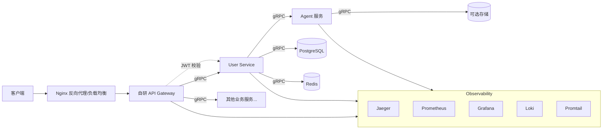

# boys-help-boys

> 一个以微服务架构构建的、带 AI Agent 能力的 Golang 项目。  
> 项目名纯属恶搞，请勿过度解读。

## 项目简介

Boys Help Boys 是一个基于微服务架构的后端项目，采用 **Nginx + API Gateway + 业务微服务 + Agent 服务** 的分层设计。当前主要实现用户服务（User Service）和一个对话 Agent，后续可扩展更多业务服务和不同类型的 Agent（如工作流、多智能体等）。

### 架构概览



- **Nginx**：作为边缘负载均衡器和反向代理，可选。
- **API Gateway**：自研，基于 Gin，负责统一认证（JWT 校验）、限流、路由转发、请求日志、Trace 生成等。
- **业务微服务**：使用 Go 编写，通过 gRPC 通信，同时通过 grpc-gateway 对外提供 HTTP 接口（可选）。
- **Agent 服务**：独立的 AI 能力服务，目前实现对话 Agent，通过 gRPC 被业务服务调用。

## 技术栈

| 类别 | 技术 |
| --- | --- |
| 语言 | Go 1.21+ |
| Web 框架 | Gin |
| RPC 框架 | gRPC + Protobuf |
| API 文档 | Swagger / OpenAPI（通过 grpc-gateway 或 gin-swagger） |
| 认证 | JWT (HS256)，密码哈希 bcrypt |
| 数据库 | PostgreSQL |
| ORM | GORM |
| 缓存 | Redis |
| 消息队列 | RabbitMQ（按需使用，用于异步任务） |
| 服务发现 & 配置 | Nacos（或 Consul） |
| 可观测性 | Jaeger（链路追踪）、Prometheus（指标）、Grafana（可视化）、Loki + Promtail（日志） |
| 容器化 | Docker |
| CI/CD | GitHub Actions |
| 限流 | uber-go/ratelimit 或自研中间件 |

## 项目结构

```text
boys-help-boys/
├── go.work                     # Go workspace 文件
├── .github/
│   └── workflows/              # CI/CD 配置
├── common/                     # 共享模块
│   ├── go.mod
│   ├── buf.yaml
│   ├── middleware/
│   ├── logger/
│   └── ...
├── gateway/                    # API Gateway 服务
│   ├── go.mod
│   ├── cmd/
│   │   └── main.go
│   ├── internal/
│   │   ├── middleware/
│   │   ├── router/
│   │   └── ...
│   └── Dockerfile
├── services/                   # 业务服务模块
│   ├── user/                   # 用户服务
│   │   ├── go.mod
│   │   ├── cmd/
│   │   ├── internal/
│   │   │   ├── server/
│   │   │   ├── repository/
│   │   │   ├── model/
│   │   │   └── ...
│   │   └── Dockerfile
│   └── ...                     # 其他业务服务
├── agents/
│   ├── chat/                   # 对话 Agent 服务（独立模块）
│   │   ├── go.mod
│   │   ├── cmd/
│   │   ├── internal/
│   │   └── Dockerfile
│   └── ...                     # 其他 Agent
├── proto/                      # Protobuf 契约模块（独立模块）
│   ├── go.mod
│   ├── buf.yaml
│   ├── user/
│   │   └── v1/
│   │       └── user.proto
│   ├── chat/
│   │   └── v1/
│   │       └── chat.proto
│   └── gen/                    # 生成的 Go 代码和 OpenAPI 文档
│       ├── go/
│       │   └── ...
│       └── openapiv2/
│           └── ...
├── deployments/                # Docker Compose、K8s 清单
│   ├── docker-compose.yml
│   └── ...
├── scripts/                    # 构建、代码生成脚本
├── docs/                       # 项目文档
└── README.md
```

## 快速开始

### 前置条件

- Go 1.21+
- Docker & Docker Compose
- Make（可选）

### 本地开发

1. 克隆仓库

```bash
git clone https://github.com/bluenotbloo/boys-help-boys.git
cd boys-help-boys
```

2. 启动依赖服务（PostgreSQL、Redis、Nacos、Jaeger、Prometheus、Grafana、Loki 等）

```bash
docker-compose -f deployments/docker-compose.yml up -d
```

3. 配置环境变量（可参考 `configs/` 目录下的示例文件）

4. 分别启动各个服务

```bash
# 启动 Gateway
cd gateway && go run ./cmd/main.go

# 启动 User Service
cd services/user && go run ./cmd/main.go

# 启动 Chat Agent
cd agents/chat && go run ./cmd/main.go
```

### 访问服务

- Gateway HTTP 默认监听 `:8080`
- User Service gRPC 默认监听 `:9000`，HTTP（grpc-gateway）可选监听 `:8081`
- Chat Agent gRPC 默认监听 `:9100`

## API 文档

- HTTP 接口：启动服务后，访问 <http://localhost:8080/swagger/index.html>（如果使用 gin-swagger）或通过 grpc-gateway 生成的 Swagger 文档。
- gRPC 接口：请查看各服务 `proto/` 目录下的 `.proto` 文件，或使用 buf 生成文档。

## 贡献指南

欢迎贡献！请遵循以下步骤：

1. Fork 本仓库
2. 创建特性分支（`git checkout -b feature/amazing-feature`）
3. 提交更改（`git commit -m 'Add some amazing feature'`）
4. 推送到分支（`git push origin feature/amazing-feature`）
5. 创建 Pull Request